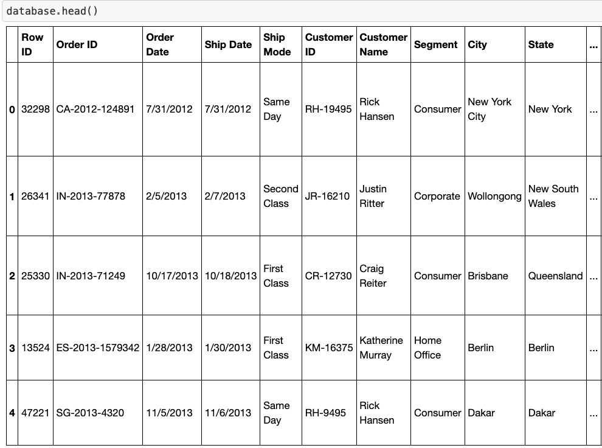
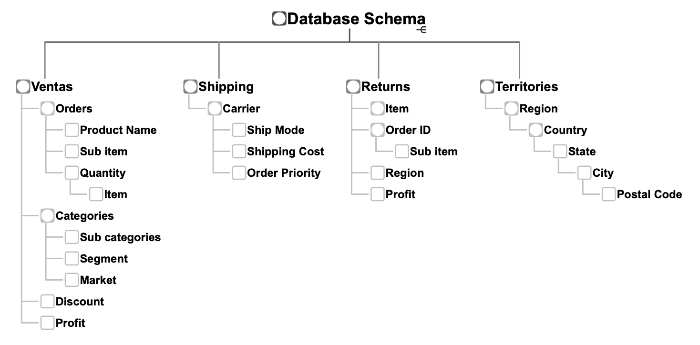
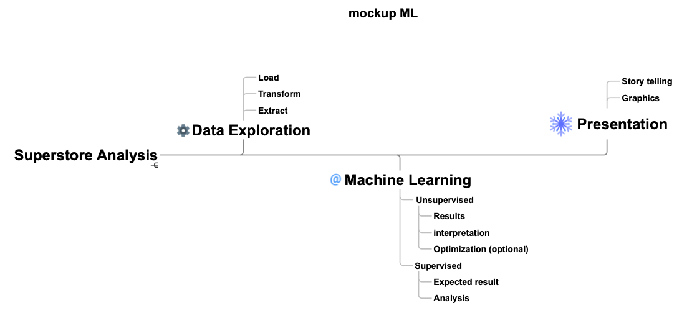
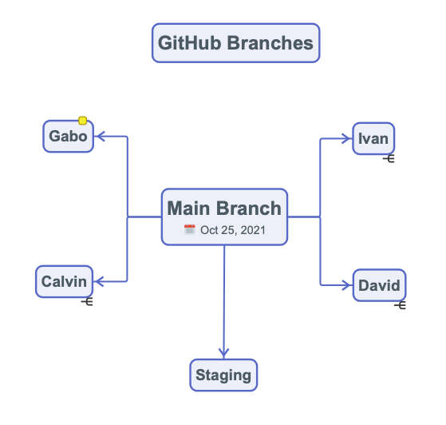
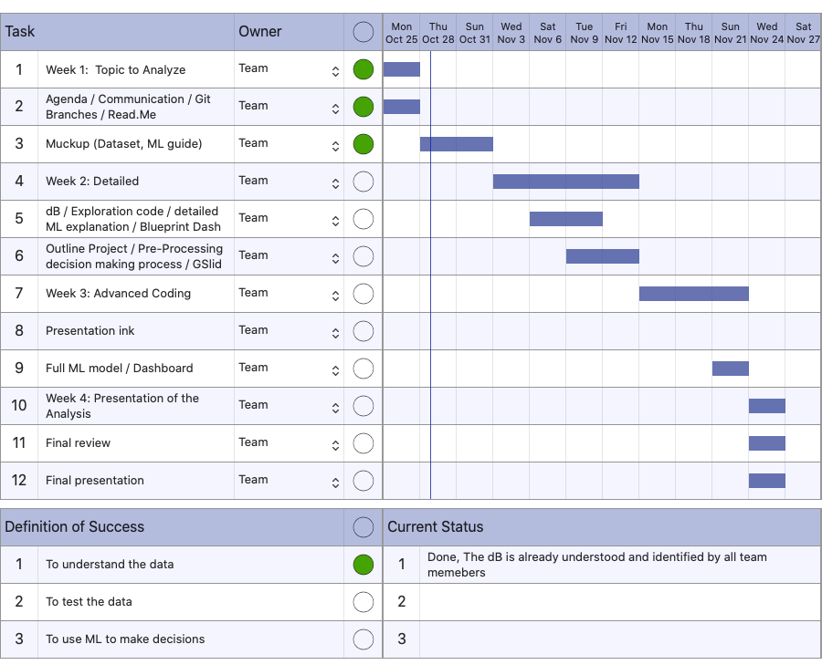

# Retail information of the SuperStore.
(selected topic)

### Deliverable info:

Dashboards created:

https://public.tableau.com/app/profile/gabo.renovation/viz/Superstore_team2_Executive-Dashboard/Dashboard1?publish=yes

https://public.tableau.com/app/profile/gabo.renovation/viz/BootCamp_Team2A/SalesPerformance?publish=yes

https://public.tableau.com/app/profile/gabo.renovation/viz/Bootcamp_Team2C/Dashboard1?publish=yes

As well as all the documentation of the Machile Learning added to this Readme (please see all the comments below).

_______________________________________________

### Summary
_______________________________________________

## Reason why we selected this topic:

- Information gathered from a trusted source related to commercial registries of an International Vendor. https://www.kaggle.com/shekpaul/global-superstore

- This data model can be also aplicable to other markets being multi-purpose.

- Its versatility can also help us to apply concepts such as ETL (Extract, Transform and Loading), Data Engineering and Machine Learning.

## Description of the data source

- Real information from a trusted source.

- The database contains 50k+ registries.

- Sales data from 2011 to 2014.

- Information in a CSV file.

----------------------------------------------

----------------------------------------------
This will be the Database Schema:

----------------------------------------------

## Questions we hope to answer with the data 

- Which territory manager is the most profitable? 
- Which territory is the most efficient (%)? 
- Shipping cost by region / country / market / city 
- Sales by Category 
- Sales by Sub-Category 
- Sales by Segment 
- % returns
- Forecast sales. Regression model based on % expected
- What category suffered the biggest change from one year to another?
- Positive and negative
- Try to explain why (hypothesis)

To be confirmed: 
New category introduction. Sales history weighted with similar products. For instance  "Tablets"
- TV's are similar in 35%
- Mobile phones are similar in 60%
- Using similarities and predict the demand of a new category or product

----------------------------------------------

The mockup for the Machine Learning would be as follows:

----------------------------------------------

#### Individual Branches already set in GitHub, so the team members will be pushing code and related information properly.

----------------------------------------------
## Machine Learning Model

Three machine learning models were developed:

1. ***Supervised machine learning to classify and predict profitable orders (profitable - not profitable).***
2. ***Supervised machine learning to classify and predict if an order is going to be returned (return - no return).***
3. ***Neural Network to predict daily sales.***

### Data preprocessing

The dataset contained the following information:

Through exploration of the dataset the following conclusions and actions took place:

- The size of the dataset had over 50,000 records wich is a good amount for a Machine Learning Model.
- Some columns needed to be transformed to a different data type, for example, columns 'ship_date' and 'order_date'.
- There were certain columns than contained null values ('postal_code','person'), therefore, needed to be discarded for the model.
- Not all columns could be used for the model as some of them had values that are not suitable for machine learning and needed to be dropped.
- Some columns could be added based on information for other columns in order to be used for the machine learning model.

### Feature engineering and preliminary feature selection, including the decision-making process

#### **First model - Supervised machine learning to classify and predict profitable orders (profitable - not profitable).** 

After the exploration was done, the following columns were dropped due to the fact that they did not have relevant information that could be used to train the model: 

From the column 'profit' we got our dependant variable (y), a new column was created from this called 'profit_classification', where the values greater 0 were classified with a 1 and values lesser than 0 were classified with 0.

For our independent variables (X) the following were chosen as we considered these were relevant to predit the outcome of profit: 'sales', 'quantity', 'ship_mode', 'segment', 'region', 'category', 'discount', 'shipping_cost', 'order_priority', 'week_day', 'month_number'. Some of these variables needed transformation as they were categorical values, using OneHotEncoder the following variables were transformed: 'ship_mode', 'segment', 'region', 'category', 'order_priority'.

#### **Second Model - Supervised machine learning to classify and predict if an order is going to be returned (return - no return).** 

For this model, the following columns were dropped due to the fact that they did not have relevant information that could be used to train the model: 

From the column 'return' we got our dependant variable (y) which has either the values Yes(1) and None(0). Using OneHotEncoder two columns were created return_Yes and return_None, both are useful for this classification process, however as we only need one return_Yes was kept. An important thing to notice is that the dataset was not balanced due to the fact that the proportion of returned orders vs not returned is 1 to 16, therefore an oversampling techniq (SMOTE) was develop to have a more balanced dataset.

For our independent variables (X) the following were chosen as we considered these were relevant to predit the outcome of profit: 'ship_mode', 'segment', 'region', 'category', 'quantity', 'discount', 'shipping_cost' and 'order_priority'. Some of these variables needed transformation as they were categorical values, using OneHotEncoder the following variables were transformed: 'ship_mode', 'segment', 'region', 'category', 'order_priority'.

#### **Third Model - Neural Network to predict daily sales.** 

In the case of this model the data had to be grouped by day as shown below:

As the purpose is to predict daily sales the columns 'sales', 'quantity', 'shipping_cost' and 'ordfer' were kept to train the model.

### Description of how data was split into training and testing sets

For all the models the dataset was split 75% for training and 25%, the reson for this is the defaul value of train_test_split function as it is based in a thumb rule for machine learning models.

### Explanation of model choice, including limitations and benefits

#### **First model - Supervised machine learning to classify and predict profitable orders (profitable - not profitable).** 

**Logistic Regression** was chosen for this purpose as it is a simple yet practical model for our goal. The reason behind this decision is beacuse is a classification model that can easily tell us in a binary way if an order will be either profitable (1) or not profitable (0). The limitations of the model is that as it is binary it could not tell us a quantity, meaning that if an order is profitable it can not tell the amount for example.

#### **Second Model - Supervised machine learning to classify and predict if an order is going to be returned (return - no return).** 

A **Balanced Random Forest** was chosen for this purpose. The reason behind this decision is beacuse is a classification model that can easily tell us in a binary way if an order will be returned (1) or not (0), also it can rank the importance of inout variables. The limitations of the model is that as it is like a black box which is hard to explian what exactly is doing or why is doing it.

#### **Third Model - Neural Network to predict weekly sales.** 

For this model a **LSTM (Long-Short Term Memory) Neural Network was used** as this is one of the most popular machine learning methods for time series forcasting which is the case at the time of predicting future sales. The benefits of this model is that it is relatively easy to train although just like the previous model it is a black box which could be a limitation when asking how the model works.

### Explanation of changes in model choice

From segment 2 to 3 there were no changes but additions, instead of having just one model, it was decided to incorporate more models for different variables that were considered important such as returned orders and future sales

### Description of how they have trained the model thus far, and any additional training that will take place

#### **First model - Supervised machine learning to classify and predict profitable orders (profitable - not profitable).** 

This model was trained with 100 iterations,no additional training is taking place for this model. 

#### **Second Model - Supervised machine learning to classify and predict if an order is going to be returned (return - no return).** 

This model was trained using 500 estimators, additional training is taking place for this model.

#### **Third Model - Neural Network to predict weekly sales.** 

This model was trained using 4 hidden layers, with 50, 70, 90 and 110 neurons each one of these had 'relu' as its activation function. As it is a regression problem it was compiled using 'mean_squared_error' as loss. The model was train for 20 epochs. Additional training is taking place for this model.

### Description and explanation of model’s confusion matrix and accuracy score

#### **First model - Supervised machine learning to classify and predict profitable orders (profitable - not profitable).** 

As seen above, the model had an accuracy score of 92.24%. When we look at the confussion matrix we can see that from the not-profitable records (3326), 2558 were predicted correctly and 768 were not, which is why it has a recall score of 0.77, on the other hand from the profitable records (9498), 9272 were predicted correctly and 226 were not, therefore its recall score is 0.98.

Overall this model is good to predict either profitable and not-profitable orders.

#### **Second Model - Supervised machine learning to classify and predict if an order is going to be returned (return - no return).** 

As seen above, the model had an accuracy score of 92.25%. However this score could be decieving, when we look at the confussion matrix we can see that from the no-return records (12015), 11402 were predicted correctly and 613 were not, therefore it has a recall score of 0.95, on the other hand from the return records (809), 163 were predicted correctly and 646 were not, therefore its recall score is 0.20.

Overall this model is good to predict if an order will **not** be returned but not so good to predict if there is going to be a return.

The advantage of the model is that we are able to see the importances of each variable, in this case the most important variables were 'shipping_cost', 'quantity', 'discount', 'region_EMEA', 'region_Africa' as seen on the  graph below.

To improve this model a larger sample will be needed.

#### **Third Model - Neural Network to predict weekly sales.** 

As this is a time-series model a good way to determine its accuracy is through the RMSE (Root Mean Square Error), in this case it was 6528.25

On the graphs below we are able to see the prediction from the model vs the real weekly sales.

Some ways we might be able to reduce the RMSE could be by keep gathering data until the sample is big enough for the neural network, the data sample for this analysis was not big enough due to limitations of the data sample.

_______________________________________________

# Relevant content of this Readme
_______________________________________________

- Exploration and Machine Learning Model - file name: **Superstore_ML_Model.ipynb**

- Entity relationship diagram (ERD) - file name: **Superstore_DataBase_Diagram.png**

- Superstore databease SQL - file name: **superstore_database.sql**

- Presentation Second Deliverable - file name: **Presentation_2nd_Deliverable.pdf**

link: https://docs.google.com/presentation/d/1kp4-RlbhRlEGugGXvVQOMgmM1YDX2mrh/edit?pli=1#slide=id.p11    

Initial Dashboard: https://public.tableau.com/app/profile/gabo.renovation/viz/BootCamp_Team2A/SalesPerformance?publish=yes

Project Dashboard: https://public.tableau.com/app/profile/gabo.renovation/viz/Bootcamp_Team2C/Dashboard1?publish=yes

Executive Dashboard:  https://public.tableau.com/app/profile/gabo.renovation/viz/Superstore_team2_Executive-Dashboard/Dashboard1?publish=yes

----------------------------------------------

Team 2 
- BootCamp Data Analytics
- June - November 2021
- All rights reserved

